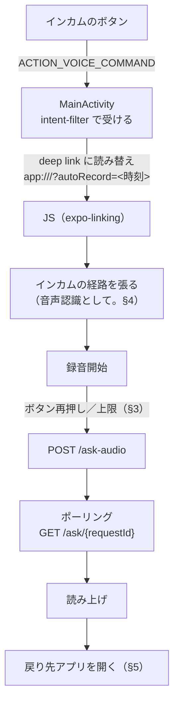

# App の設計

App は薄いクライアントに徹する。録音・再生・位置の取得・起動の経路だけを持ち、STT/TTS・住所の解決・回答の生成は AWS 側にある
（[docs-parent/01_technical_policies.md](../docs-parent/01_technical_policies.md)）。
Backend との約束は [docs-parent/03_units_contracts.md](../docs-parent/03_units_contracts.md) の UC-4。

走行中は画面を見られず手も使えない。この章の設計のほとんどはこの制約から来ている。

| | |
|---|---|
| 画面 | `src/app/`（`index.tsx`・`settings.tsx`） |
| ロジック | `src/api/` |
| ネイティブ | `plugins/withVoiceInteraction.js`（起動）・`modules/bt-audio-route/`（インカムの経路）・`modules/app-foreground/`（戻り先を開く） |
| 経緯 | [adr/](../adr/README.md) |

## 1. ハンズフリーの一巡

インカムのボタンひとつで、起動から復帰まで画面に触れずに完結する（US-2.04）。



## 2. 起動：`ACTION_VOICE_COMMAND` を Activity で受ける

インカムのボタンを押すと Android が `ACTION_VOICE_COMMAND` を発行し、`MainActivity` の intent-filter で受ける（[adr/001](../adr/001_handsfree_launch_mechanism.md)）。
端末の既定のデジタルアシスタントは Google のままでよい。

⚠️ Google App が `VOICE_COMMAND` の既定（preferred activity）に固定されていると、intent-filter があっても無視される（ボタンを押すと Google が開く）。初回だけ `設定 > アプリ > Google > デフォルトをクリア` で固定を外す。アシスタントのロールを明け渡すのとは別物。

### ネイティブから JS への受け渡し

`MainActivity` は Intent を `app:///?autoRecord=<時刻>` に読み替えて `super` に渡し、JS は `expo-linking` の `useURL()` で受ける。

| 設計 | 理由 |
|---|---|
| `onCreate` と `onNewIntent` の両方で拾う | `launchMode="singleTask"` なので、起動済みかどうかで呼ばれる側が変わる |
| URL に毎回異なる値（時刻）を入れる | `useURL()` は値が変わらないと再発火しない。固定の文字列だと2回目以降の押下が無視される |
| 処理済みかは押した時刻で判定する | `useURL()` は最初に起動したときの古い URL を遅れて返すことがある。最後に処理した押下より古い時刻は捨てる（状態は画面の外に持つ。`src/api/handsfreeLaunch.ts`） |
| 録音の開始処理中の押下は捨てる | 開始には経路の確立待ちがあり、その間に2本目が走ると互いの経路を潰し合う |
| 位置と API キーが揃うまで処理済みにしない | どちらも非同期に届く。欠けたまま録音を始めてもエラーで無音に終わり、画面を見ないので気づけない |
| 録音中の押下は「送信」に分ける | 同じ Intent でも録音中かどうかで意味が変わる（§3）。録音開始の処理より前に見る（あちらは録音中を弾き、「いま応答中です」と読み上げてしまう） |

⚠️ `MainActivity.kt` は `withVoiceInteraction.js` が全文を生成する。`android/` を手で直しても `prebuild` で消える。

## 3. 録音の終了

停止と送信は分けない（走行中に2回操作できない）。出口は2つ（[adr/003](../adr/003_end_of_speech_detection.md)）。

| 出口 | 中身 |
|---|---|
| インカムのボタン再押し | 「話し終えた」とみなす。音は見ない。1秒未満の押下は弾く（チャタリング対策） |
| `maxRecordingMs` に達する | 押し忘れの受け皿。質問を失わせない |

どちらかが必ず効くので、録音は必ず送られる。再押しの届き方はマイクの経路で変わる。

| 録音中のマイク | 2回目の押下が App に届く形 |
|---|---|
| インカム（§4） | Intent は来ない。インカムが音声認識を止めて経路を切るので、それを検知する（`watchIntercomEnded`） |
| 本体マイク（経路を張れなかった／録音中に切れた） | 録音中の `VOICE_COMMAND` |

| 設定値 | 既定 | 意味 |
|---|---|---|
| `maxRecordingMs` | 20,000ms | 上限。押し忘れの出口であり、押さずに待つときの待ち時間でもある |
| `audioSource` | `voice_communication` | 録音の用途（`MediaRecorder.AudioSource`）。端末側のノイズ除去が変わる。実測で最も効いた |

設定値は「コードの既定値 → `.env`（`EXPO_PUBLIC_*`）→ 端末に保存された値」の順に解決し、後のものが優先される（`src/api/recordingSettings.ts`）。

録音中は、自動送信までの残り秒数を画面で最も大きい文字（56px）で出す。押さずに待つか判断するのに要り、走行中に一瞬の視線で読める必要がある。

音量で「話し終えた」を判定する仕組み（無音検知）は持たない。エンジン音で `metering` が 0 dBFS に飽和し、発話しても値が動かないため。

## 4. 録音のマイク：インカムの経路を「音声認識」として張る

録音はインカムのマイクで行う（[adr/005](../adr/005_intercom_mic_routing.md)）。経路（SCO）だけを自前モジュール `modules/bt-audio-route` で張り、録音は `expo-audio` に任せる。

```
BluetoothHeadset.startVoiceRecognition(device)   ← インカムの「音声認識を始めて」に返事をする
  → Bluetooth スタックが SCO を張る（実測 約220ms）
  → setMode(MODE_IN_COMMUNICATION)                ← 通話系の経路は自動で SCO に向く
録音
  → stopVoiceRecognition(device) + MODE_NORMAL
```

| 設計 | 理由 |
|---|---|
| 仮想通話（`setCommunicationDevice`）で張らない | ボタンで起動した直後はインカムが返事待ちで張れず、録音中のボタンが「電話を切る」になって2回目の押下が届かない |
| ⚠️ `setCommunicationDevice()` を併用しない | 併用すると、インカムが経路を切った後に AudioService が仮想通話で張り直す |
| ⚠️ 押下から約5秒以内に `startVoiceRecognition` を呼ぶ | インカムは返事を待ち、スマホは約5秒で待ちを打ち切る。押下からの経過を記録に残す |
| 経路の切断は通知と 0.2秒ごとの確認の両方で見る | 片方を取りこぼしても2回目の押下を失わない |
| 購読は経路を張る前に始める | 張ってから購読するまでの間に切れると、2回目の押下を取りこぼす |
| セッションに番号を振り、通知は機器も照合する | 自分で止めたときの切断や、別の HFP 機器（車載器など）の切断を2回目の押下と取り違えない |
| 録音開始から1秒未満で切れたら、送らずに本体マイクへの切り替えとして扱う | 経路はもう無いので、無視すると警告なしに本体マイクで録り続ける。画面に警告を出し、次の押下（`VOICE_COMMAND`）で送る |
| 張れなければ本体マイクで録って続行する | 走行中に黙るのが最も困る。インカムがあるのに張れなかったときだけ画面に警告を出す |
| 経路と録音の記録を端末内のファイルにも残す | logcat は数分で流れる。実際に録っているマイクも録音の開始直後と終了直前に残す（取り出し方は [SETUP.md](../SETUP.md)） |

## 5. 応答後にナビのアプリへ戻る

戻り先は設定画面で選んだアプリを LAUNCHER インテントで開く（[adr/002](../adr/002_return_to_map_after_answer.md)、ネイティブは `modules/app-foreground/`）。
起動し直しではなく既存タスクの再開なので、案内中のルートは壊れない。

| 設計 | 理由 |
|---|---|
| 戻り先をパッケージ名で設定に持つ | どのナビのアプリを使っているかは App から知り得ない |
| 未設定なら何もしない（ただし画面に出す） | 勝手にどこかへ飛ばさない。黙って何もしないと故障に見える |
| 回答が届いてから戻す | 背面では JS が凍結する（§7） |
| ハンズフリー起動で始まった一往復だけ戻す | 画面から操作したときは、見ている画面を隠さない |

戻したかどうかは2つのフラグで持つ。

| フラグ | 意味 | 倒れるとき |
|---|---|---|
| `launchedHandsFree` | まだ戻していない | 戻した時点、および一往復が失敗で終わったとき |
| `wasHandsFree` | この一往復がハンズフリーだった | 一往復の終わり |

⚠️ 戻した後に起きる失敗の判定には `launchedHandsFree` を使えない（既に倒れている）。読み上げで知らせるかは `wasHandsFree` で決める。

## 6. 画面に出しても見えない＝音で知らせる

ハンズフリー起動で始まった一往復（`wasHandsFree`）の失敗は、端末内蔵の TTS（`expo-speech`）で読み上げる。背面に回った後は画面が見えず、黙って諦めると、走行中は「押せていない」のか「壊れた」のか区別がつかない。画面から操作したときは画面に出すだけにする。

| 場面 | 読み上げる |
|---|---|
| 応答待ちの最中にボタンを押された | 「いま応答中です。少し待ってからもう一度お話しください。」 |
| ポーリングが打ち切られた／中断された | 「回答を取得できませんでした。もう一度お話しください。」 |
| 送信中に例外 | 「送信に失敗しました。もう一度お話しください。」 |
| 回答は来たが音声が無い（合成の失敗） | 回答の本文をそのまま読み上げる |

## 7. 背面では JS が凍結する

Android は背面のプロセスをキャッシュ化して凍結するので、`setTimeout` が進まずポーリングが止まる。フォアグラウンドサービスは持たないので、背面では待てない。

- 回答を待ってから戻すのはこのため（§5）。
- 新しい起動は前の質問のポーリングを捨てる（残すと次の質問で前の答えが返る）。捨てるのは録音が始まってから（逆にすると、応答待ち中に押したとき前の回答だけが失われ、録音も始まらない）。

## 8. ポーリング

間隔・打ち切り・止める条件は契約（UC-4）のとおり。実装は `src/app/index.tsx` の `POLL_STEPS` と `pollForAnswer`。

- 一時的な通信断と 429 は無視して打ち切りまで続け、403 は即座に諦める（走行中は電波が不安定なため）。
- 画面を離れた・会話をリセットしたら即座に止める（`pollAbort`）。

## 9. 音声モードはプロセス全体で2つに固定する

`setAudioModeAsync` はプロセス全体に効く。画面ごとに値を書くと後から呼んだ画面が全体を上書きするので、録音向きと再生向きの2つだけを `src/api/voice.ts` に置く。

| モード | 要点 |
|---|---|
| `AUDIO_MODE_RECORDING` | 録音中は他の音を止める |
| `AUDIO_MODE_PLAYBACK` | `shouldPlayInBackground: true`（無いと背面で読み上げが止まる）と `interruptionMode: "mixWithOthers"`（フォーカスを要求しない） |

ナビのアプリは案内音声のためにオーディオフォーカスを取り、奪われると `expo-audio` は再生を一時停止する。`mixWithOthers` で要求しないようにする。ナビの音声と重なって鳴るが、どちらも走行中に聞きたい情報なのでそれでよい。

⚠️ 録音を捨てるときも音声モードを必ず戻す。録音向きのままだと以降の読み上げが鳴らない。

## 10. 位置と進行方位の2点目

方位の計算は Backend が行い、App は2点の座標（`start`＝現在地、`end`＝過去の位置）を送るだけ。方位そのものは送らない。

2点目は、直近の位置の履歴を新しい方から遡り、5m以上離れた最初の点を選ぶ。

| 定数 | 値 | 役割 |
|---|---|---|
| `MIN_DISTANCE_METERS` | 5m | これ未満は GPS の誤差。起点にしない |
| `MAX_ORIGIN_AGE_MS` | 30秒 | これより古い点は「いまの向き」の根拠にしない |
| `MAX_HISTORY_AGE_MS` | 2分 | 履歴の保持の上限 |

- 起点が決まったら、それより古い点は捨てる。
- 距離で上限を切らない。速度で2点間の距離は大きく変わり（60km/h なら3秒で50m）、距離で切ると高速走行時に方位が出なくなる。
- 停車中は GPS の更新が届かない（`distanceInterval` を満たさない）ので、止まったことをタイマーで判定し直す。
- 2点目が無いとき（起動直後・停車中・方向転換の直後）は `end` を送らない。Backend は方位なしで質問を通す。誤った方位を渡すより、渡さない方がよい。
- 会話の最初の質問からの経過秒数（`elapsedSeconds`）も送る。

画面には方位磁針（矢印・16方位・左右）を出している。Backend と同じ式で計算しているので、表示と AI の回答が食い違えばどちらかがおかしいと分かる。

## 11. 画面

UI は動作確認に足る最小限にとどめる。

| 画面 | 役割 |
|---|---|
| `src/app/index.tsx` | 質問と回答。押して話すボタン・方位磁針・残り秒数 |
| `src/app/settings.tsx` | API キー・録音の設定（上限・用途）・戻り先アプリ |

- API キーは `expo-secure-store`（Android では Keystore で暗号化）。録音の設定・戻り先は秘密ではないので AsyncStorage。
- 「設定」「新しい会話を始める」はボタンにして18pxにする。走行中には押さないが、停車中に手袋のままでも押せるように。

### 戻り先アプリの選び方

- 「戻る/戻らない」の二択を先に置き、「戻る」を選んだときだけアプリの一覧を出す。一覧に「戻らない」を混ぜると、一時的に切ったときに選んだアプリまで消える。オフにしても選択は残す。
- インストール済みアプリは多すぎるので、最近選んだもの（5件）を先頭に出し、名前（ラベル・パッケージ名の部分一致）で絞り込めるようにする。
- 「最近選んだもの」は1件ずつ外せる（誤って選んだものが上位に居座らないように）。外しても戻り先の設定は変わらない。
- お気に入りの手動登録は作らない。★を付ける操作自体が、多すぎる一覧から探す作業になる。
- 絞り込み欄には見出しを付ける。プレースホルダだけだと、入力を消したときにどこが入力欄か分からなくなる。
